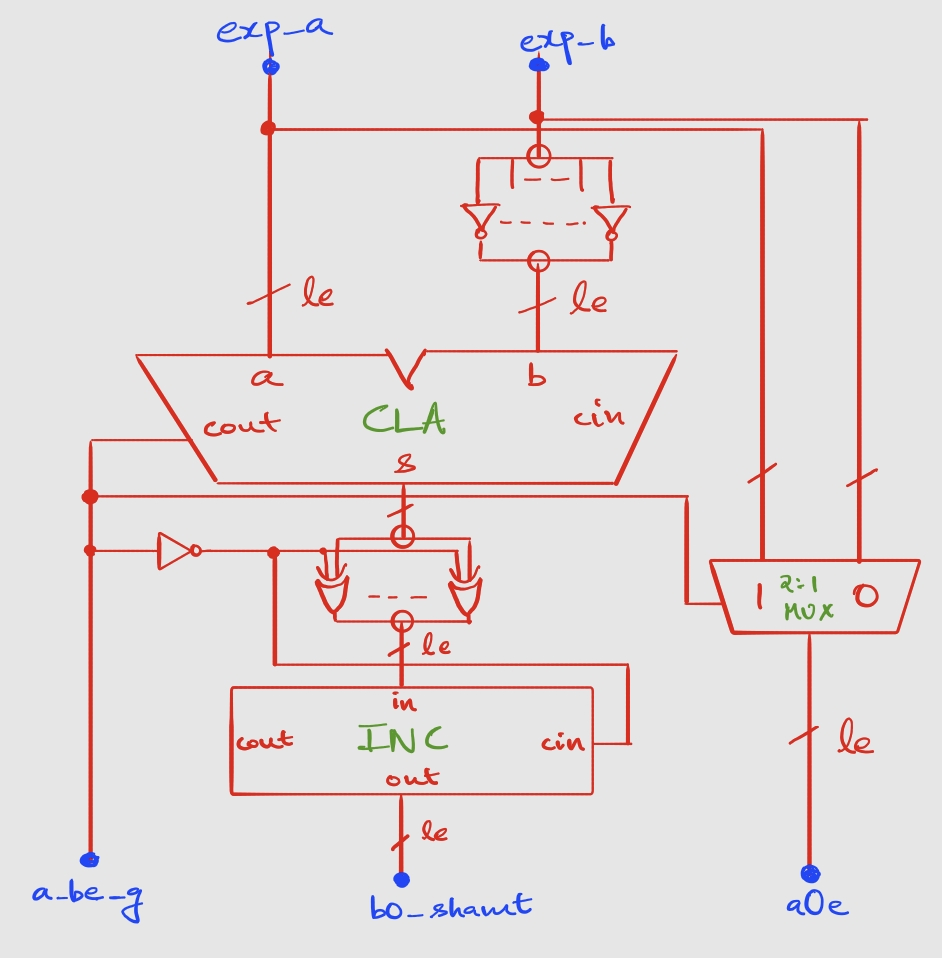

# Exponent Comparator
**File** - `src/datapath/e_comparator.v`
## Purpose
- To obtain the absolute difference of exponents of input operands, and pass it to the mantissa alignment module: *shamt* (diagram), *m_shamt* (o/p port in *e_comparator*), *b0_shamt* (mapped wire in *fpadd*)
- To pass the larger exponent as an output, result exponent is around the larger exponent: *$E_{A_0}$* (diagram), *a0e* (o/p port in *e_comparator* and mapped wire in *fpadd*)
- To pass the boolean comparison result if exp_a > exp_b, for mantissa add/sub operation and output sign determination: *ageb*(diagram), *a_ge_b* (o/p port in *e_comparator* and mapped wire in *fpadd*)

## Architectural Decisions
- Since both *ageb* and *shamt* (absolute difference) are required, a **subtractor** circuit with a **conditional 2s-complement** circuit can be used. Operand order is fixed, i.e. *exp_a* and *exp_b* are always subtracted in the order *exp_a - exp_b*. 
- The subtractor is built using a parameterized-width (*le*) **CLA** **adder** circuit with inverted subtrahend and carry-in *cin* to be 1. The tradeoffs of this design would be the *smaller delay* as compared to the RCA, but at the cost of *greater area* and *power consumption*
- The *cout* or carry-out bit of subtractor determines *ageb*.
```math
    s =  (2^n + a - b) \mod 2^n \\
    C_{out} = \begin{cases} 1 & \text{if } a \ge b \\ 0 & \text{if } a < b \end{cases} \\
    \implies ageb = C_{out}
```
- The conditional 2s complement circuit is implemented using an **incrementer** circuit and **XOR** gates. The incrementer is built using an RCA with a fixed input of 000...0*cin*, hence utilizing only half-adders. The tradeoff is to choose *greater delay* over *area* and *hardware complexity*, especially with a constant input.
- Incrementer input bits *in* are XOR-ed with ~*ageb* to trigger 2s-complementation if *exp_a* < *exp_b*. Carry-input bit *cin* is just ~*ageb* for the same reason.
- The larger exponent is selected using a **2-to-1 multiplexer** circuit, with select-input *ageb*.

## Architectural Diagram
