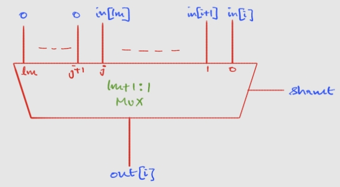
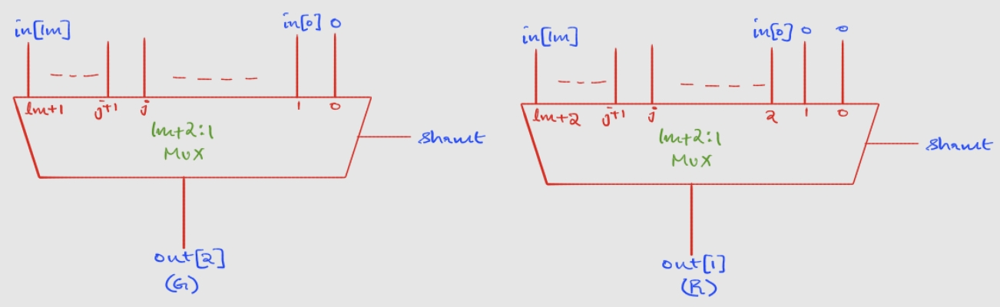
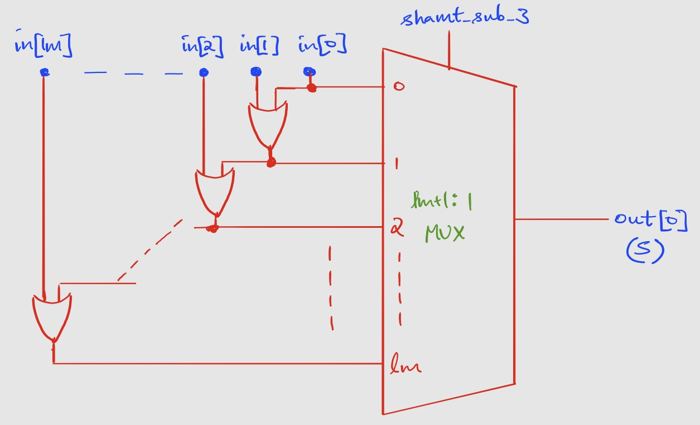

# Mantissa Alignment
**File** - `lm_r_shifter.v`
## Purpose
- To receive the *lm+1* input mantissa bits *in* (with leading 1 for normalized numbers and 0 for sub-normal numbers) of $B_0$ (number with smaller exponent), and right-shift the bits based on the input *shamt* from the exponent-comparator
- To output the $lm+1$ right-shifted mantissa bits, along with rounding suffix bits: G, R and S. The output is collectively passed as a single $lm+4$ bit vector *out*.

## Architectural Decisions
### Shift-Amount Clipping
- The shift-amount *shamt* is obtained from the exponent-comparator, which is an *le*-bit vector. Hence, input *shamt* varies from $[0, 2^{le} - 1]$.
- There are a total of *lm+1* mantissa bits, and usually, even in the case of 32-bit single-precision fp, $lm+1 << 2^{le}$ or $le >> log_2(lm+1)$
- For an *lm+1* bit barrel right-shifter, *shamt* is fed into the select lines of the *lm+1* mux array, which are of $log_2(lm+1)$ bits.
- Hence, the *le*-bit *shamt* input vector can represent values considerably larger than *lm+1*.
- For all values of *shamt > lm+1*, the result of right-shifting remains identical (without considering sticky-bit logic). Hence, to avoid unnecessary hardware, the *shamt* input is clipped to *lm+1* using a **min** circuit, described in `min.v`
- The *le*-bit *shamt* is clipped to an *le*-bit vector *shamt_*, whose upper bits are truncated/discarded, with only the *lm+1* least significant bits being passed to the select lines of the barrel shifter.

    (*Check out [Test 6](./logs/running_doc.md#test-6) wherein I was discovered the error in my previous methodology of truncating to $log_2(lm+1)$ bits and then clipping*)
### Barrel Shifter
- A **barrel shifter** circuit was constructed using a **generate** block to perform the right-shift operation. For outputs bits [lm+3:3], *lm+1* multiplexers were instantiated for each output bit. Given below is the diagram of a single multiplexer in the barrel shifter:

### Rounding Suffix Bits
- The final result mantissa is outputted in this format: 

    [--shifted-manstissa--] | G R S

- G and R bits are the immediate two spill-over bits from right-shifting. They are obtained by simply **extending the barrel shifter**, by adding two more muxs corresponding to the G and R bits. However, G would be fed by an *lm+2*:1 mux, while R would be fed by an *lm+3*:1 mux, as shown below:

- The S bit is obtained by performing a **reduction OR** on all the bits that are shifted out of the mantissa, beyond the G and R bits. This means that the reduction OR is applied on a variable number of input mantissa bits, given by *shamt-3* (for *shamt* < 3, the S bit is 0).
- A **ripple OR-bank** was created to perform the reduction OR operation on every first *i* bits, where *i* ranges from 0 to *lm*. The output of each intermediate reduction-OR was tapped as the input line to a multiplexer, whose select line was *shamt-3*
- Given below is the diagram for the S bit generation circuit:

