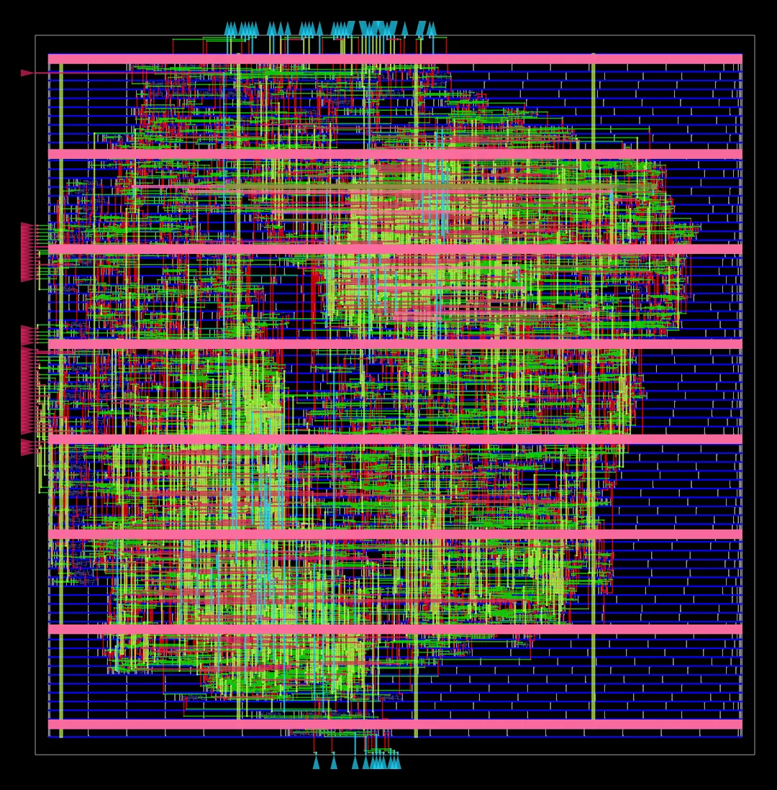
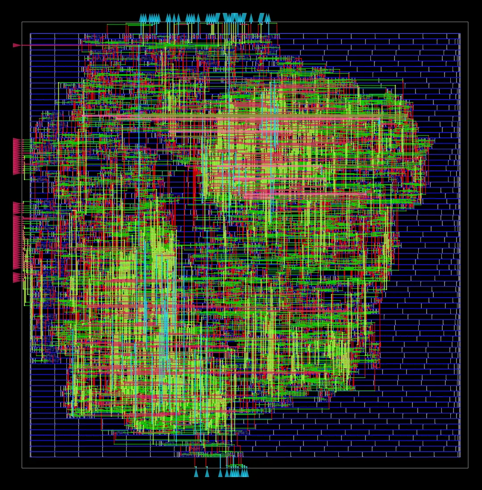
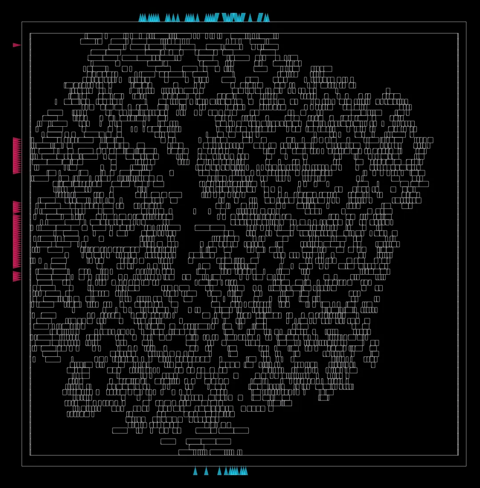
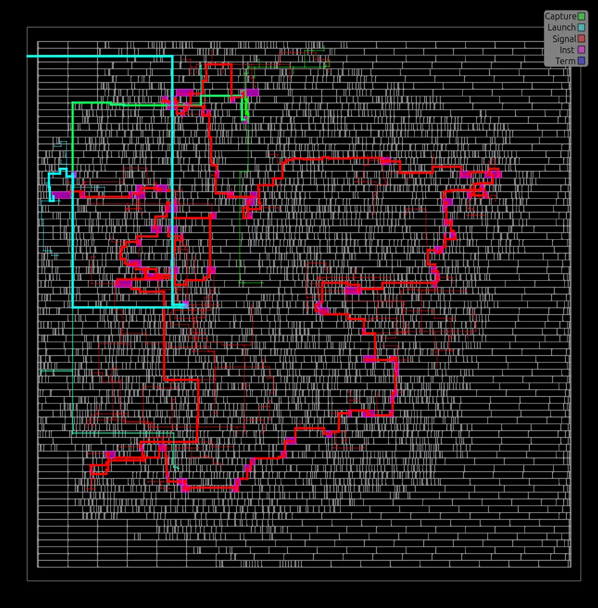
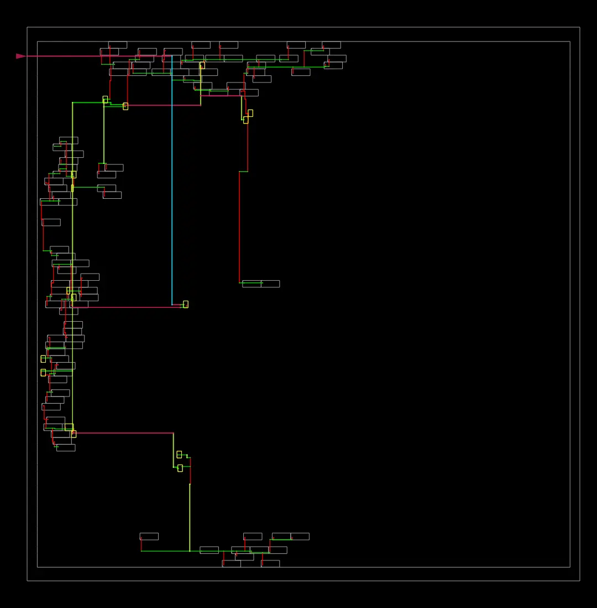
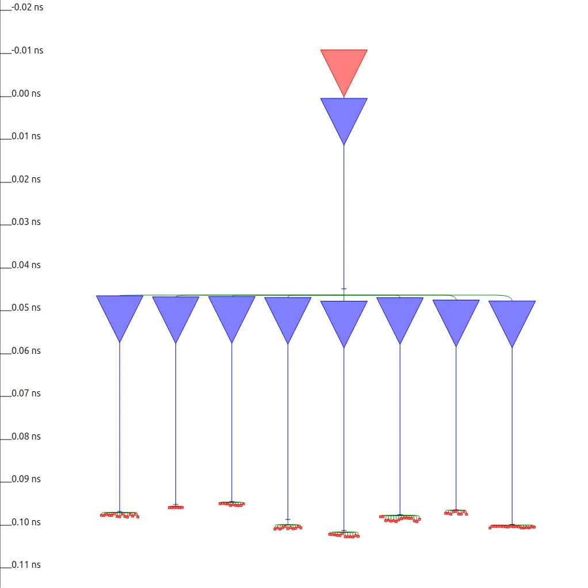
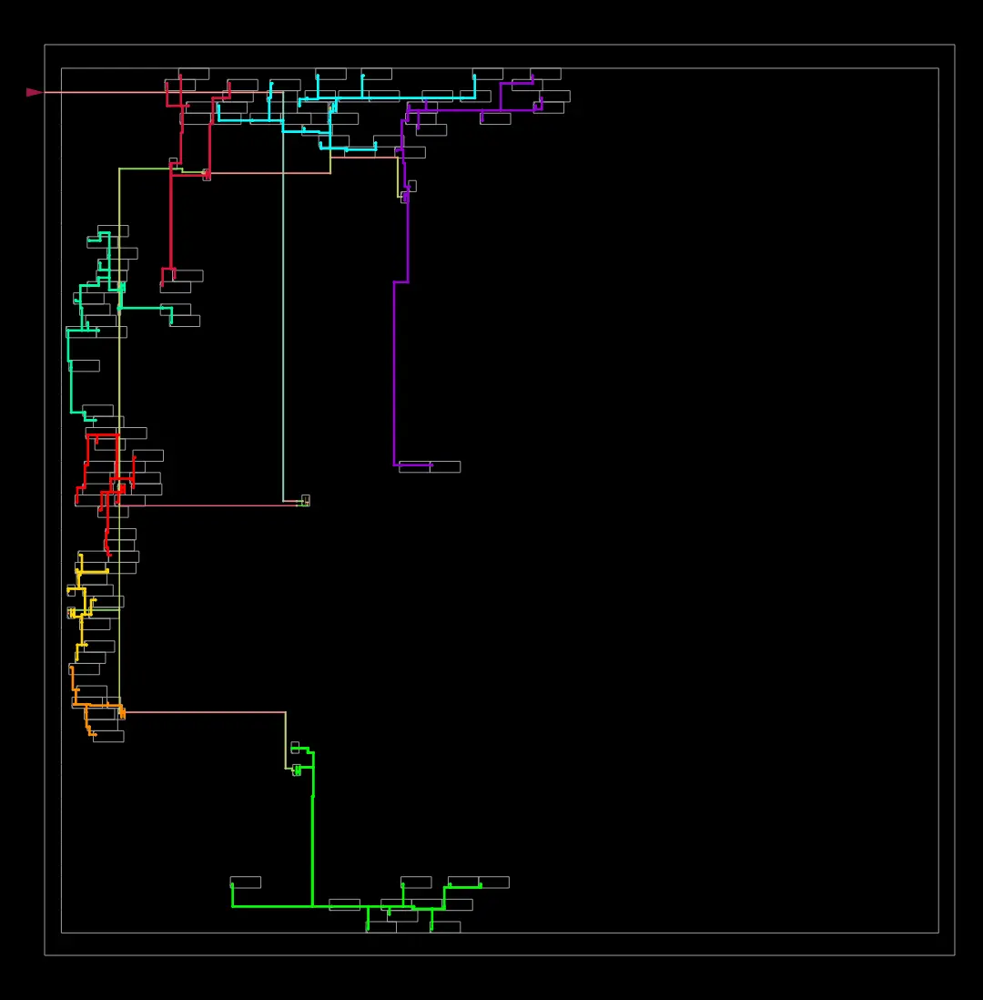
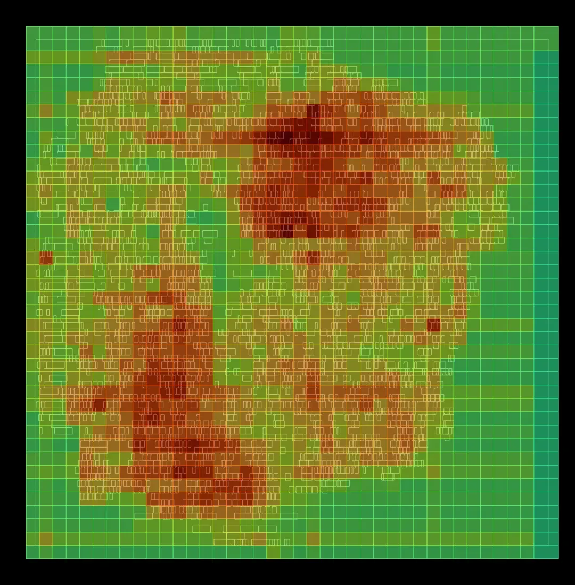
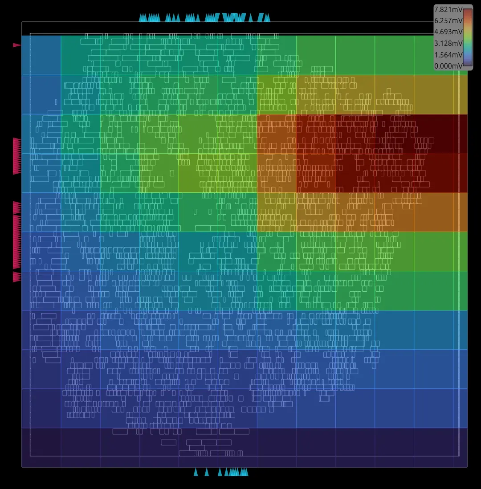
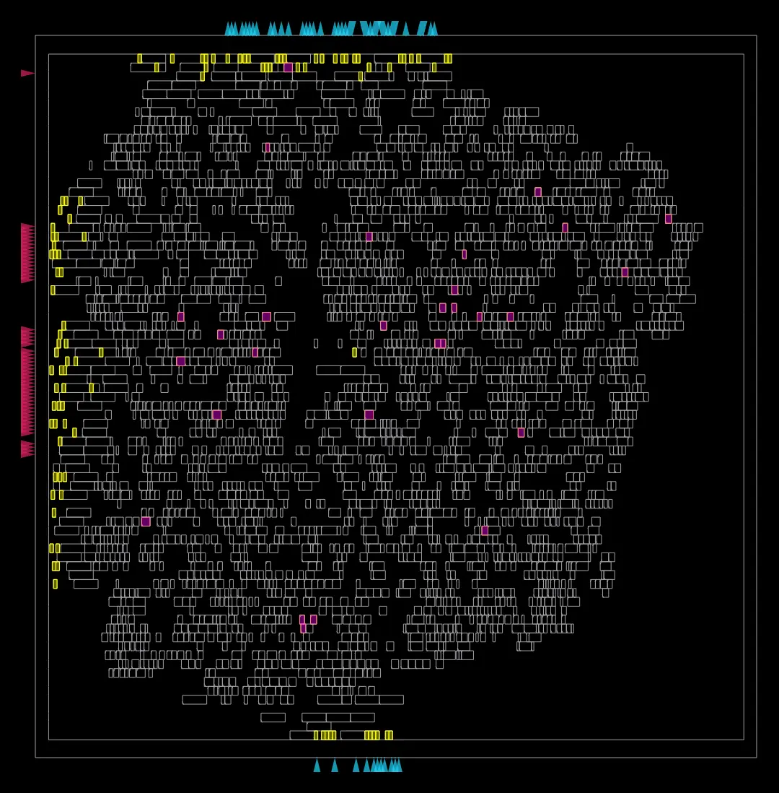

# ORFS RTL-to-GDS Flow (rough notes)

## Setup
| Item | Value |
|---|---|
| Design | `fpadd_top`, fp32 (`lm=23`, `le=8`) |
| PDK | nangate45 (typical) |
| Clock period | 5.0 ns (`asic/constraint.sdc`) |
| Config | `asic/config.mk` (`CORE_UTILIZATION=35`, `PLACE_DENSITY=0.50`) |
| Outputs | `asic/orfs/{logs,reports,results,objects}/nangate45/fpadd/base/` |

## Commands
Run from `OpenROAD-flow-scripts/flow` after `source ../env.sh`, stages in order:
```bash
make DESIGN_CONFIG=/ExternalDisk/Git/fp-adder-verilog/asic/config.mk synth
make DESIGN_CONFIG=/ExternalDisk/Git/fp-adder-verilog/asic/config.mk floorplan
make DESIGN_CONFIG=/ExternalDisk/Git/fp-adder-verilog/asic/config.mk place
make DESIGN_CONFIG=/ExternalDisk/Git/fp-adder-verilog/asic/config.mk cts
make DESIGN_CONFIG=/ExternalDisk/Git/fp-adder-verilog/asic/config.mk route
make DESIGN_CONFIG=/ExternalDisk/Git/fp-adder-verilog/asic/config.mk finish
```

## Timing and area per stage (run 1)
| Stage | Worst setup slack (ns) | WNS / TNS | Area (µm²) | Report |
|---|---|---|---|---|
| Yosys standalone, area-oriented (ref, [sta.md](./sta.md)) | −0.886 | −0.89 / −23.83 | 2691 | — |
| Synthesis (ORFS, ABC speed) | — | — | 4200 | `synth_stat.txt` |
| Floorplan | +0.52 | 0 / 0 | ~4100 | `2_floorplan_final.rpt` |
| Global placement | +0.31 | 0 / 0 | — | `3_global_place.rpt` |
| Resizer | +0.35 | 0 / 0 | 4110 | `3_resizer.rpt` |
| Detailed placement | +0.31 | 0 / 0 | 4110 | `3_detailed_place.rpt` |
| CTS | +0.30 | 0 / 0 | 4130 | `4_cts_final.rpt` |
| Global route | +0.16 | 0 / 0 | — | `5_global_route.rpt` |
| **Finish (signoff)** | **+0.26** | **0 / 0** | **4130** | `6_finish.rpt` |

## Synthesis: Yosys standalone vs ORFS
| Metric | Yosys (area) | ORFS (speed) |
|---|---|---|
| Cells | 1889 | 2995 |
| Area (µm²) | 2691 | 4200 |
| Sequential area (µm²) | 516 | 516 |
| Drive strengths | X1 only | X1–X4 |
| `HA_X1` / `FA_X1` | 0 / 0 | 96 / 0 |
| Check problems | — | 0 |

## Signoff (finish, run 1)
| Metric | Value |
|---|---|
| Worst setup slack | +0.26 ns |
| Critical path delay | 4.752 ns |
| Worst hold slack | +0.07 ns (`a[31]` → `c_out[31]`) |
| Setup / hold violations | 0 / 0 |
| Min period / fmax (`report_clock_min_period`) | 4.74 ns / 210.97 MHz (at a 5.0 ns target, not true Fmax) |
| Clock latency (source / target) | 0.10 / 0.10 ns |
| Clock skew (setup) | 0.05 ns |
| Design area | 4130 µm² |
| Utilization | 35% |
| DRC violations (detailed route) | 0 |
| Antenna violations | 0 net / 0 pin |
| Max slew / max fanout violations | 0 / 0 (no fanout limit set) |
| **Max capacitance violations** | **1**: `_3099_/ZN`, 28.19 fF vs 26.70 fF limit (−1.49 fF) |
| Logic equivalence (`6_final_lec_check.log`) | Passed, "Circuits are IDENTICAL" |

## Max-capacitance violation (run 1)
| Item | Value |
|---|---|
| Pin | `_3099_/ZN` |
| Load / limit | 28.19 fF / 26.70 fF (+5.6%) |
| Impact | Electrical, not timing; delay extrapolated beyond the cell's characterized range |
| Likely cause | Routed wire capacitance exceeded placement-stage estimates |
| Fix | `CAP_MARGIN = 20` in `asic/config.mk` → run 2: 0 violations, worst cap slack +3.52 fF |

## Run 1 vs run 2 (`CAP_MARGIN = 20`, clean re-run)
| Metric | Run 1 | Run 2 |
|---|---|---|
| Max-cap violations | 1 | 0 |
| Worst setup slack | +0.26 ns | +0.34 ns |
| Min period / fmax | 4.74 ns / 210.97 MHz | 4.66 ns / 214.43 MHz |
| Critical path delay | 4.752 ns | 4.678 ns |
| Worst hold slack | +0.07 ns | +0.07 ns |
| Setup / hold / slew violations | 0 / 0 / 0 | 0 / 0 / 0 |
| Clock skew (setup) | 0.05 ns | 0.06 ns |
| DRC violations | 0 | 0 |
| Design area | 4130 µm² | 4160 µm² |
| Logic equivalence | Identical | Identical |

## Power (finish, default switching activity)
| Run | Internal (W) | Switching (W) | Leakage (W) | Total (W) |
|---|---|---|---|---|
| 1 | 1.61e-03 | 1.96e-03 | 9.54e-05 | 3.67e-03 |
| 2 | 1.63e-03 | 1.97e-03 | 9.64e-05 | 3.69e-03 |

## Layout images (run 2)
Generated by ORFS at `finish` (`asic/orfs/reports/.../*.webp`), copied to `docs/images/orfs/`.

| View | Image |
|---|---|
| Full layout |  |
| Routing |  |
| Placement |  |
| Worst setup path |  |
| Clock tree |  |
| CTS clock tree |  |
| CTS clock tree on layout |  |
| Routing congestion |  |
| IR drop |  |
| Resizer changes |  |

## Open
- [x] Hold slack at signoff: +0.07 ns, 0 violations
- [x] `6_final_lec_check.log`: passed ("No elapsed time found" is only a metrics-script notice)
- [x] Fix the 1 max-capacitance violation on `_3099_/ZN` (run 2, `CAP_MARGIN = 20`)
- [ ] Fmax sweep (ORFS only optimizes until slack ≥ 0 at the given period)
- [x] Layout images (ORFS-generated, `docs/images/orfs/`)
- [ ] Add a layout image to the main README
